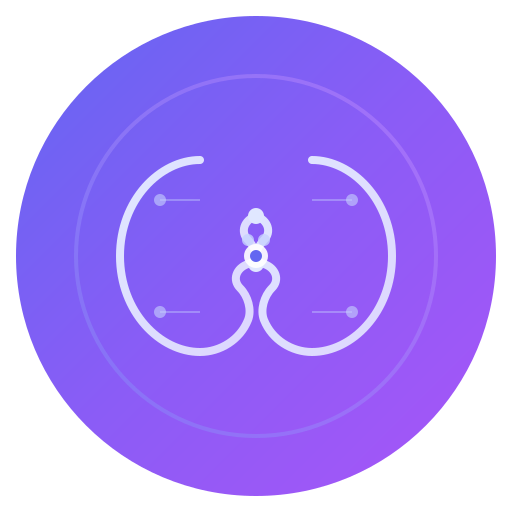

  
  <h1 align="center">
    <a href="https://cortexos.ai">Cortex OS</a>
  </h1>

  
  
  
  

  

# ✨ Features

- 🖥️ **UI & Experience** inspired by ChatGPT with enhanced design and features

- 🤖 **AI Model Selection**:  
  - Anthropic (Claude), AWS Bedrock, OpenAI, Azure OpenAI, Google, Vertex AI, OpenAI Responses API (incl. Azure)
  - [Custom Endpoints](https://www.cortexos.ai/docs/quick_start/custom_endpoints): Use any OpenAI-compatible API with Cortex OS, no proxy required
  - Compatible with [Local & Remote AI Providers](https://www.cortexos.ai/docs/configuration/cortex-os_yaml/ai_endpoints):
    - Ollama, groq, Cohere, Mistral AI, Apple MLX, koboldcpp, together.ai,
    - OpenRouter, Helicone, Perplexity, ShuttleAI, Deepseek, Qwen, and more

- 🔧 **[Code Interpreter API](https://www.cortexos.ai/docs/features/code_interpreter)**: 
  - Secure, Sandboxed Execution in Python, Node.js (JS/TS), Go, C/C++, Java, PHP, Rust, and Fortran
  - Seamless File Handling: Upload, process, and download files directly
  - No Privacy Concerns: Fully isolated and secure execution

- 🔦 **Agents & Tools Integration**:  
  - **[Cortex OS Agents](https://www.cortexos.ai/docs/features/agents)**:
    - No-Code Custom Assistants: Build specialized, AI-driven helpers
    - Agent Marketplace: Discover and deploy community-built agents
    - Collaborative Sharing: Share agents with specific users and groups
    - Flexible & Extensible: Use MCP Servers, tools, file search, code execution, and more
    - Compatible with Custom Endpoints, OpenAI, Azure, Anthropic, AWS Bedrock, Google, Vertex AI, Responses API, and more
    - [Model Context Protocol (MCP) Support](https://modelcontextprotocol.io/clients#cortex-os) for Tools

- 🔍 **Web Search**:  
  - Search the internet and retrieve relevant information to enhance your AI context
  - Combines search providers, content scrapers, and result rerankers for optimal results
  - **Customizable Jina Reranking**: Configure custom Jina API URLs for reranking services
  - **[Learn More →](https://www.cortexos.ai/docs/features/web_search)**

- 🪄 **Generative UI with Code Artifacts**:  
  - [Code Artifacts](https://youtu.be/GfTj7O4gmd0?si=WJbdnemZpJzBrJo3) allow creation of React, HTML, and Mermaid diagrams directly in chat

- 🎨 **Image Generation & Editing**
  - Text-to-image and image-to-image with [GPT-Image-1](https://www.cortexos.ai/docs/features/image_gen#1--openai-image-tools-recommended)
  - Text-to-image with [DALL-E (3/2)](https://www.cortexos.ai/docs/features/image_gen#2--dalle-legacy), [Stable Diffusion](https://www.cortexos.ai/docs/features/image_gen#3--stable-diffusion-local), [Flux](https://www.cortexos.ai/docs/features/image_gen#4--flux), or any [MCP server](https://www.cortexos.ai/docs/features/image_gen#5--model-context-protocol-mcp)
  - Produce stunning visuals from prompts or refine existing images with a single instruction

- 💾 **Presets & Context Management**:  
  - Create, Save, & Share Custom Presets  
  - Switch between AI Endpoints and Presets mid-chat
  - Edit, Resubmit, and Continue Messages with Conversation branching  
  - Create and share prompts with specific users and groups
  - [Fork Messages & Conversations](https://www.cortexos.ai/docs/features/fork) for Advanced Context control

- 💬 **Multimodal & File Interactions**:  
  - Upload and analyze images with Claude 3, GPT-4.5, GPT-4o, o1, Llama-Vision, and Gemini 📸  
  - Chat with Files using Custom Endpoints, OpenAI, Azure, Anthropic, AWS Bedrock, & Google 🗃️

- 🌎 **Multilingual UI**:
  - English, 中文 (简体), 中文 (繁體), العربية, Deutsch, Español, Français, Italiano
  - Polski, Português (PT), Português (BR), Русский, 日本語, Svenska, 한국어, Tiếng Việt
  - Türkçe, Nederlands, עברית, Català, Čeština, Dansk, Eesti, فارسی
  - Suomi, Magyar, Հայերեն, Bahasa Indonesia, ქართული, Latviešu, ไทย, ئۇيغۇرچە

- 🧠 **Reasoning UI**:  
  - Dynamic Reasoning UI for Chain-of-Thought/Reasoning AI models like DeepSeek-R1

- 🎨 **Customizable Interface**:  
  - Customizable Dropdown & Interface that adapts to both power users and newcomers

- 🌊 **[Resumable Streams](https://www.cortexos.ai/docs/features/resumable_streams)**:  
  - Never lose a response: AI responses automatically reconnect and resume if your connection drops
  - Multi-Tab & Multi-Device Sync: Open the same chat in multiple tabs or pick up on another device
  - Production-Ready: Works from single-server setups to horizontally scaled deployments with Redis

- 🗣️ **Speech & Audio**:  
  - Chat hands-free with Speech-to-Text and Text-to-Speech  
  - Automatically send and play Audio  
  - Supports OpenAI, Azure OpenAI, and Elevenlabs

- 📥 **Import & Export Conversations**:  
  - Import Conversations from Cortex OS, ChatGPT, Chatbot UI  
  - Export conversations as screenshots, markdown, text, json

- 🔍 **Search & Discovery**:  
  - Search all messages/conversations

- 👥 **Multi-User & Secure Access**:
  - Multi-User, Secure Authentication with OAuth2, LDAP, & Email Login Support
  - Built-in Moderation, and Token spend tools

- ⚙️ **Configuration & Deployment**:  
  - Configure Proxy, Reverse Proxy, Docker, & many Deployment options  
  - Use completely local or deploy on the cloud

- 📖 **Open-Source & Community**:  
  - Completely Open-Source & Built in Public  
  - Community-driven development, support, and feedback

[For a thorough review of our features, see our docs here](https://docs.cortexos.ai/) 📚

## 🪶 All-In-One AI Conversations with Cortex OS

Cortex OS is a self-hosted AI chat platform that unifies all major AI providers in a single, privacy-focused interface.

Beyond chat, Cortex OS provides AI Agents, Model Context Protocol (MCP) support, Artifacts, Code Interpreter, custom actions, conversation search, and enterprise-ready multi-user authentication.

Open source, actively developed, and built for anyone who values control over their AI infrastructure.

---

## 🌐 Resources

**GitHub Repo:**
  - **RAG API:** [github.com/danny-avila/rag_api](https://github.com/danny-avila/rag_api)
  - **Website:** [github.com/Cortex OS-AI/cortexos.ai](https://github.com/Cortex OS-AI/cortexos.ai)

**Other:**
  - **Website:** [cortexos.ai](https://cortexos.ai)
  - **Documentation:** [cortexos.ai/docs](https://cortexos.ai/docs)
  - **Blog:** [cortexos.ai/blog](https://cortexos.ai/blog)

---

## 📝 Changelog

Keep up with the latest updates by visiting the releases page and notes:
- [Releases](https://github.com/ZSmith-GenZ/cortex-os/releases)
- [Changelog](https://www.cortexos.ai/changelog) 

**⚠️ Please consult the [changelog](https://www.cortexos.ai/changelog) for breaking changes before updating.**

---

## ⭐ Star History

  

  
  

---

## ✨ Contributions

Contributions, suggestions, bug reports and fixes are welcome!

For new features, components, or extensions, please open an issue and discuss before sending a PR.

If you'd like to help translate Cortex OS into your language, we'd love your contribution! Improving our translations not only makes Cortex OS more accessible to users around the world but also enhances the overall user experience. Please check out our [Translation Guide](https://www.cortexos.ai/docs/translation).

---

## 💖 This project exists in its current state thanks to all the people who contribute

---

## 🎉 Special Thanks

We thank [Locize](https://locize.com) for their translation management tools that support multiple languages in Cortex OS.

  

